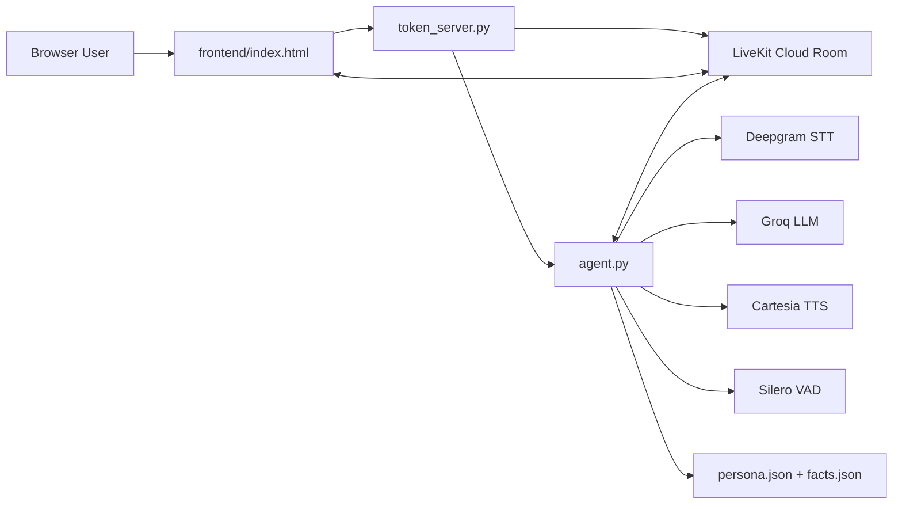

# Digital Twin

Digital Twin is a real-time voice assistant that acts like a conversational version of Danish. The current implementation is built around a LiveKit-based voice pipeline and a custom browser UI. It is designed to feel like a live call, not a text chatbot.

## Features

- Real-time voice conversations over LiveKit instead of record-and-wait chat.
- Persona-grounded responses using structured `persona.json` and `facts.json`.
- Low-latency speech pipeline with Deepgram STT, Groq LLM, and Cartesia TTS.
- Lightweight custom browser UI with live transcript feedback and session state.
- Handles interruptions gracefully during live conversation turns.
- Streamlit prototype retained for local testing and fallback comparison.

## Current architecture

The current runtime is split into three parts:

| Layer | File | Responsibility |
|---|---|---|
| Frontend | [frontend/index.html](frontend/index.html) | Browser UI, audio controls, transcript display, connection state |
| Token server | [token_server.py](token_server.py) | Serves the frontend and issues LiveKit JWTs |
| Agent runtime | [agent.py](agent.py) | LiveKit agent that handles STT, LLM, TTS, and grounding |

The supporting data and config files are:

| File | Purpose |
|---|---|
| [persona.json](persona.json) | Persona, tone, values, and response style |
| [facts.json](facts.json) | Ground truth about Danish; the agent should not invent beyond this |
| [.env](.env) | Local secrets for LiveKit and model providers |
| [requirements.txt](requirements.txt) | Python dependencies |
| [Dockerfile](Dockerfile) | Container build for deployment |

### Architecture diagram



## Runtime flow

1. The browser loads the frontend page from the FastAPI server.
2. The frontend requests a LiveKit access token from `/api/token`.
3. The token server creates a new room, signs a JWT, and dispatches the agent into that room.
4. The browser joins the room over WebRTC.
5. The LiveKit agent receives the user’s audio stream.
6. Deepgram transcribes speech to text.
7. Groq generates the reply using the persona and facts as grounding.
8. Cartesia converts the reply to speech.
9. The audio is streamed back to the browser and shown in the transcript UI.

This is the main difference from the earlier Streamlit version: the LiveKit path is streaming and room-based, so it behaves like a live conversation instead of record-upload-wait-playback.

## External services

| Service | Role |
|---|---|
| LiveKit Cloud | Real-time room transport and agent dispatch |
| Deepgram | Streaming speech-to-text |
| Groq | LLM inference |
| Cartesia | Low-latency text-to-speech |
| Silero | Voice activity detection |
| FastAPI | HTTP token server and frontend host |
| Uvicorn | ASGI server runtime |

## Deployment

### LiveKit deployment

The LiveKit architecture is deployed as a Python service plus static frontend. The Dockerfile builds a container that:

- installs Python dependencies
- downloads the Silero model assets
- starts the agent and token server together

### Earlier Streamlit deployment

The Streamlit app was the earlier deployment path. It remains in the repository as the older UI approach, but it is not the main real-time architecture.

## Environment variables

The project expects these runtime values:

- `LIVEKIT_URL`
- `LIVEKIT_API_KEY`
- `LIVEKIT_API_SECRET`
- `GROQ_API_KEY`
- `OPENAI_API_KEY` for the older Streamlit fallback

These are loaded with `python-dotenv` in both the agent and the server code.

## Repository layout

```
.
├── agent.py
├── app.py
├── facts.json
├── frontend/
│   └── index.html
├── persona.json
├── token_server.py
├── Dockerfile
├── requirements.txt
├── .envexample
└── README.md
```

## Important reality check

This repository contains both the old Streamlit prototype and the current LiveKit voice app. If you are reading only this README, the main thing to understand is:

- `app.py` = older Streamlit implementation
- `agent.py` + `token_server.py` + `frontend/index.html` = current real-time LiveKit implementation
